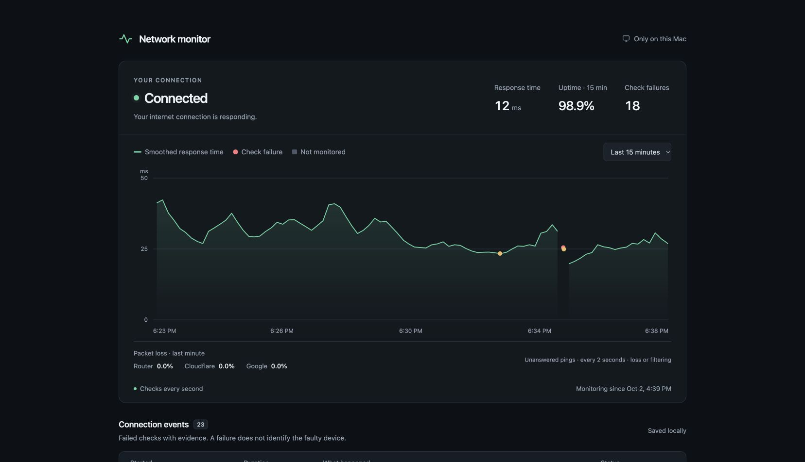

# Network Monitor Dashboard

I kept noticing my connection dipping, so I built a simple dashboard to see when it drops, how long it lasts, and the likely cause.



## Run locally

Requires **macOS, Python 3.9+, and Google Chrome**. No extra packages.

```bash
git clone https://github.com/yogi-miraje/network-monitor-dashboard.git
cd network-monitor-dashboard
python3 launcher.py start
```

Opens **http://localhost:8787/**. Or double-click **Start.command**.

To stop: `python3 launcher.py stop` or double-click **Stop.command**.

## How it works

- Checks Google and Cloudflare every second; both must fail to record a drop.
- Shows one response-time graph and saved events with times, durations, and likely causes.
- Checks DNS separately and uses router checks to help explain failures.
- Keeps running when Chrome closes. Mac sleep appears as a monitoring gap; restart the monitor after rebooting.
- Saves history in `data/history.sqlite3`, excluded from Git. No cloud uploads.

Very brief drops and failures limited to one app, website, or VPN may be missed. Likely causes are estimates.

## Tests

```bash
python3 -m unittest discover -s tests -v
```
